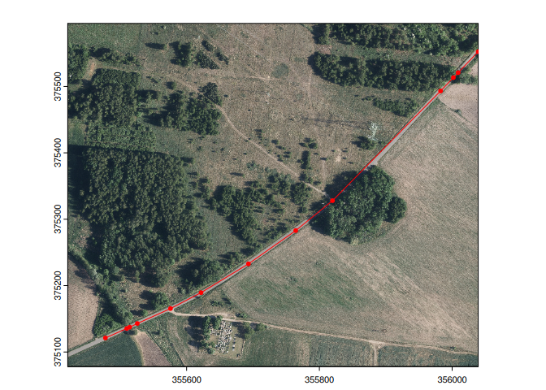
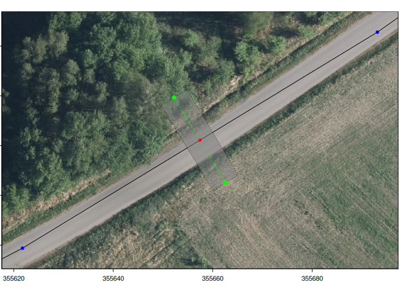
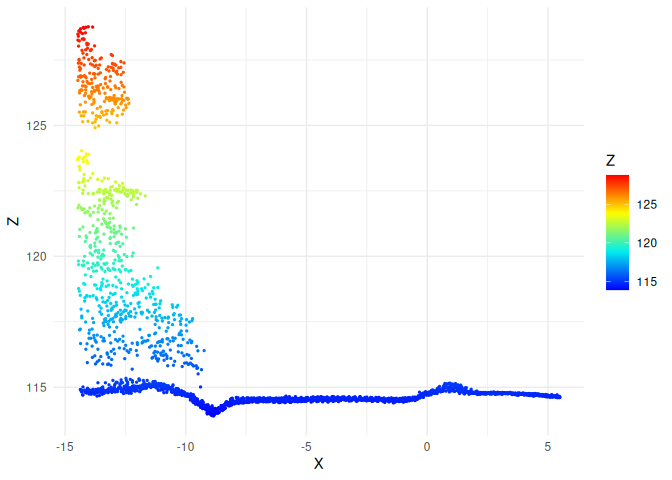
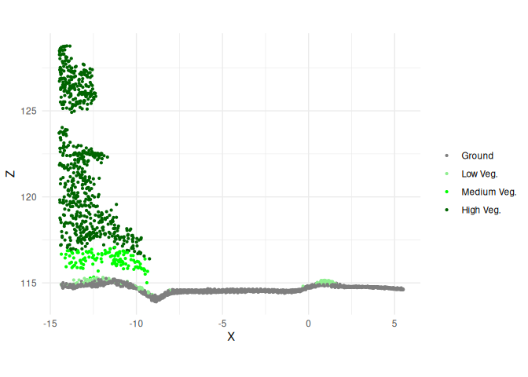
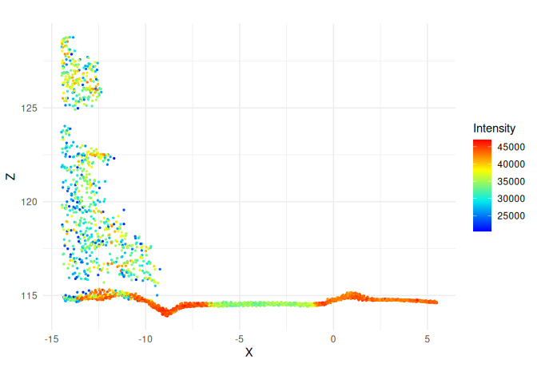
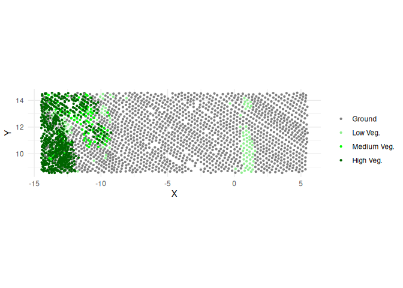
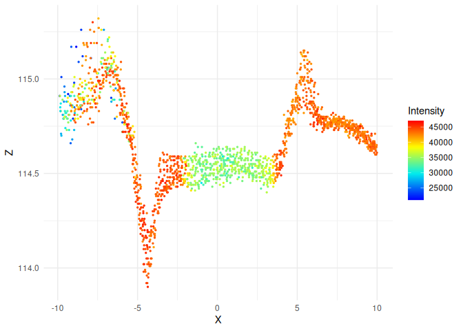
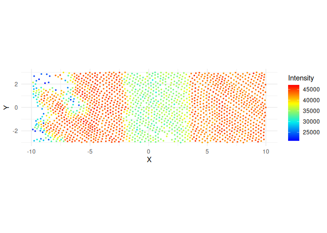
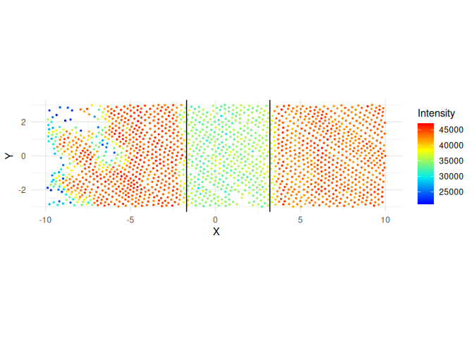

# Highways width based on LIDAR data
Grzegorz Sapijaszko

## The purpose

The purpose of this work is to find a way to calculate the roads width
based on LIDAR points and enhance the OpenStreetMap roads data with that
information.

## Data preparation

The example based on tertiary road between Zajączków and Kotowice,
Oborniki Śląskie municipality, Poland.

<details class="code-fold">
<summary>Code</summary>

``` r
if (!dir.exists("../data")) {
  dir.create("../data")
}

options(timeout = 60*20)
if(!file.exists("../data/zajaczkow.csv")) {
  a <- osmdata::getbb("Zajączków, trzebnicki", format_out = "sf_polygon") |>
    sf::st_centroid() |>
    sf::st_buffer(dist = 500) |>
    rgugik::DEM_request()
  
  write.csv(a, file = "../data/zajaczkow.csv")
} else {
  a <- read.csv(file = "../data/zajaczkow.csv")
}

a |>
  subset(product == "PointCloud" & year == "2022" & resolution == "12 p/m2") |>
  rgugik::tile_download(outdir = "../data", 
                          method = "wget", 
                          extra = "--no-check-certificate -c --progress=bar:force")

rm(a)

f <- list.files(path = "../data", pattern = "laz", full.names = TRUE)

convertLAZ <- function(lazfile, outdir = ".", filter = "-keep_class 2 9", crs = "EPSG:2180") {
  if(!dir.exists(outdir)) { dir.create(outdir, recursive = TRUE)}
  message(lazfile)
  .file <- basename(lazfile)
  .outfile <- paste0(outdir, "/", stringi::stri_replace_all_fixed(.file, "laz", "las"))
  if(!file.exists(.outfile)) {
    las <- lidR::readLAS(files = lazfile, filter = {{filter}})
    if(is.na(lidR::crs(las))) {
      lidR::crs(las) <- {{crs}}
    }
    lidR::writeLAS(las, file = .outfile, index = TRUE)
  }
  else {
    message("Output file ", .outfile, " already exists, skipping conversion.")
  }
}

lapply(f, convertLAZ, filter = "", outdir = "../data")
rm(f)
rm("convertLAZ", envir = .GlobalEnv)

if(!file.exists("../data/zajaczkow.gpkg")) {
  b <- osmdata::getbb("Zajączków, trzebnicki") |>
    osmdata::opq() |>
    osmdata::add_osm_features(features = c("\"boundary\"" = "\"administrative\"", 
                                           "\"highway\"")) |>
    osmdata::osmdata_sf()
  
  l <- lidR::readLAS("../data/76503_1213480_M-33-34-B-d-1-4-2-2.las")
  
  l_ext <- lidR::ext(l)  |>
    terra::as.polygons() |>
    sf::st_as_sf()
  
  sf::st_crs(l_ext) <- lidR::crs(l)
  
  h <- 
    b$osm_lines |>
    subset(!is.na(highway) & 
             !highway %in% c("track", "path", "footway", "cycleway")) |>
    sf::st_transform(crs = lidR::crs(l))
  
  h <- sf::st_intersection(h, l_ext)
  
  sf::write_sf(h, "../data/zajaczkow.gpkg", append = FALSE)
  
}

if (!file.exists("../data/r.tif")) {
  l <- lidR::readLAS("../data/76503_1213480_M-33-34-B-d-1-4-2-2.las")
  
  r <- lidR::rasterize_terrain(l, res = 0.2)
  terra::writeRaster(r, "../data/r.tif", overwrite = TRUE)
} 

## orthofoto

if(!file.exists("../data/76501_1076083_M-33-34-B-d-1-4.tif")) {
  l <- lidR::readLAS("../data/76503_1213480_M-33-34-B-d-1-4-2-2.las")
  
  l_ext <- lidR::ext(l)  |>
    terra::as.polygons() |>
    sf::st_as_sf()
  
  sf::st_crs(l_ext) <- lidR::crs(l)
  
  a <- rgugik::ortho_request(l_ext)
  
  a |>
    subset(year == "2022" & grepl("B-d-1-4", filename)) |>
    rgugik::tile_download(outdir = "../data", 
                          method = "wget", 
                          extra = "--no-check-certificate -c --progress=bar:force")
}

l <- lidR::readLAS("../data/76503_1213480_M-33-34-B-d-1-4-2-2.las")
r <- terra::rast("../data/r.tif")
ortho <- terra::rast("../data/76501_1076083_M-33-34-B-d-1-4.tif")
h <- sf::read_sf("../data/zajaczkow.gpkg")
```

</details>

The road consists of several linestrings, let’s combine them together to
have one longer `LINESTRING`.

``` r
h <- h |>
  subset(highway == "tertiary")  |>
  sf::st_cast(to = "MULTIPOINT") |>
  sf::st_union() |>
  sf::st_cast(to = "LINESTRING")
```

<details class="code-fold">
<summary>Code</summary>

``` r
m <- sf::st_bbox(h)
dx <- as.integer(m["xmax"] - m["xmin"])
dy <- as.integer(m["ymax"] - m["ymin"])

# par(pty = "s")
x_min <- as.integer(m["xmin"] - 0.1 * dx)
x_max <- as.integer(m["xmax"] + 0.1 * dx)
y_min <- as.integer(m["ymin"] - 0.1 * dy)
y_max <- as.integer(m["ymax"] + 0.1 * dy)

vertices <- h |>
  sf::st_coordinates() |>
  as.data.frame() |>
  sf::st_as_sf(coords = c("X", "Y"), crs = "EPSG:2180")

terra::plotRGB(ortho, 
               xlim = c(x_min, x_max),
               ylim = c(y_min, y_max),
               axes = TRUE,
               mar = c(1.5, 0, 1.5, 0)
               )

terra::plot(h, col = "red", add = TRUE)

terra::plot(vertices$geometry, col = "red", pch = 20, add = TRUE)
```

</details>

<div id="fig-owerview">



Figure 1: Orthophoto view of the road with vertices added (shown in
red).

</div>

The approach is to find a point in the middle between pair of vertices
and create a 20-m long and 6 m wide “transect” at this point: 10 m left
and 10 m right from the road.
<a href="#fig-transect_overviev" class="quarto-xref">Figure 2</a> shows
an example.

<details class="code-fold">
<summary>Code</summary>

``` r
v <- 6 #7

p1 <- vertices[v, "geometry"] |>
  sf::st_coordinates()

p2 <- vertices[v+1, "geometry"] |>
  sf::st_coordinates()

dx <- p2[1] - p1[1]
dy <- p2[2] - p1[2]

ll <- sqrt(dx^2 + dy^2)

#' alpha in radians
alpha <- atan(dy/dx)

xm <- p1[1] + ll * cos(alpha) / 2
ym <- p1[2] + ll * sin(alpha) / 2

pm <- sf::st_sfc(sf::st_point(c(xm, ym)), crs = "EPSG:2180")

d <- 10
xm1 <- xm - d * cos(pi/2 + alpha) 
ym1 <- ym - d * sin(pi/2 + alpha)
pm1 <- sf::st_sfc(sf::st_point(c(xm1, ym1)), crs = "EPSG:2180")

xm2 <- xm + d * cos(pi/2 + alpha) 
ym2 <- ym + d * sin(pi/2 + alpha)
pm2 <- sf::st_sfc(sf::st_point(c(xm2, ym2)), crs = "EPSG:2180")

# line
coords <- rbind(c(xm1, ym1), c(xm2, ym2))
line <- sf::st_linestring(coords)
line <- sf::st_sfc(line)

poly <- sf::st_buffer(line, dist = 3, endCapStyle = "FLAT") |>
  sf::st_sfc(crs = "EPSG:2180")

# plotting

xmin <- min(p1[1], p2[1])
xmax <- max(p1[1], p2[1])
ymin <- min(p1[2], p2[2])
ymax <- max(p1[2], p2[2])


terra::plotRGB(ortho,
               xlim = c(xmin - 0.05*ll, xmax + 0.05*ll),
               ylim = c(ymin - 0.05*ll, ymax + 0.05*ll),
               axes = TRUE,
               mar = c(1.5, 0, 1.0, 0))

plot(sf::st_geometry(h), add = TRUE)
plot(sf::st_geometry(vertices), pch = 20, col = "blue", add = TRUE)

plot(poly, lwd = 0.6, col = "#80808088", lty = 3, add = TRUE)

plot(pm, pch = 20, col = "red", add = TRUE)
plot(pm1, pch = 16, size = 1.2, col = "green", add = TRUE)
plot(pm2, pch = 16, size = 1.2, col = "green", add = TRUE)
plot(line, lty = 3, col = "green", add = TRUE)
```

</details>

<div id="fig-transect_overviev">



Figure 2: Analized area of the road: <span style="color:red;">red
point</span> – middle of the linestring, green line – perpendicular line
with length of 20 m, gray area – analized area: 20x6 m.

</div>

Let’s see how LIDAR data looks like in the analyzed area.

<details class="code-fold">
<summary>Code</summary>

``` r
###| layout-ncol: 2
###| column: body-outset

x <- lidR::clip_transect(l, c(xm1, ym1), c(xm2, ym2), width = 6, xz = TRUE)
x <- lidR::filter_poi(x, Classification != 12L)

bb <- lidR::st_bbox(x)

class_cols <- c(
  "0" = "black",       # never classified
  "1" = "gray90",      # unassigned
  "2" = "gray50",      # ground
  "3" = "lightgreen",  # low vegetation
  "4" = "green",       # medium vegetation
  "5" = "darkgreen",   # high vegetation
  "6" = "brown",       # building
  "7" = "gray90",      # noise
  "8" = "gray90",      # reserved
  "9" = "blue",        # water
  "10" = "gray33",     # rail
  "11" = "gray33",     # road surface
  "12" = "black")      # reserved

library(ggplot2)

ggplot(x@data, aes(X, Z, color = Z)) +
  geom_point(size = 0.5) +
  #  coord_equal() +
  theme_minimal() +
  scale_color_gradientn(colours = lidR::height.colors(50))

ggplot(x@data, aes(X, Z, color = factor(Classification))) +
  geom_point(size = 0.8) +
  coord_equal() +
  theme_minimal() +
  scale_color_manual(values = class_cols, name = "", labels = c("Ground", "Low Veg.", "Medium Veg.", "High Veg."))

ggplot(x@data, aes(X, Z, color = Intensity)) +
  geom_point(size = 0.5) +
  #  ylim(114, 116) +
  coord_equal() +
  theme_minimal() +
  scale_color_gradientn(colours = lidR::height.colors(50))

ggplot(x@data, aes(X, Y, color = factor(Classification))) +
  geom_point(size = 0.8) +
  coord_equal() +
  theme_minimal() +
  scale_color_manual(values = class_cols, name = "", labels = c("Ground", "Low Veg.", "Medium Veg.", "High Veg."))
```

</details>

<div id="fig-transect_lidar">

<div class="cell-output-display">

<div id="fig-transect_lidar-1">



(a) points height

</div>

</div>

<div class="cell-output-display">

<div id="fig-transect_lidar-2">



(b) points classification

</div>

</div>

<div class="cell-output-display">

<div id="fig-transect_lidar-3">



(c) points intensity

</div>

</div>

<div class="cell-output-display">

<div id="fig-transect_lidar-4">



(d) X-Y view of LIDAR points by classification

</div>

</div>

Figure 3: LIDAR data plots in analyzed area.

</div>

The points data contains several classes: ground points, low, middle and
high vegetation, etc. We will filter out only points classified as
ground and low vegetation. The data is transposed a bit by original
buffer bounding box and rotation angle, we have to center it to the
linestring mid point.

<details class="code-fold">
<summary>Code</summary>

``` r
###| layout-ncol: 2
###| column: body-outset

y <- x |>
  lidR::filter_poi(Classification %in% c(2L, 3L))

y$X <- y$X - (bb["xmin"] + (bb["xmax"]-bb["xmin"])/2)
y$Y <- y$Y - (bb["ymin"] + (bb["ymax"]-bb["ymin"])/2)

ggplot(y@data, aes(X, Z, color = Intensity)) +
  geom_point(size = 0.5) +
#  ylim(114, 116) +
  #  coord_equal() +
  theme_minimal() +
  scale_color_gradientn(colours = lidR::height.colors(50))

ggplot(y@data, aes(X, Y, color = Intensity)) +
  geom_point(size = 0.5) +
  #  ylim(114, 116) +
  coord_equal() +
  theme_minimal() +
  scale_color_gradientn(colours = lidR::height.colors(50))
```

</details>

<div id="fig-transect_centered">

<div class="cell-output-display">

<div id="fig-transect_centered-1">



(a) points height with intensity

</div>

</div>

<div class="cell-output-display">

<div id="fig-transect_centered-2">



(b) X-Y view of points intensity

</div>

</div>

Figure 4: LIDAR data plots centered on midpoint

</div>

<a href="#fig-transect_centered-1" class="quarto-xref">Figure 4 (a)</a>
shows 20 m long crossection of LIDAR points with their height and
intensity. You may notice the almost flat area around 0 with uniform
intensity which corresponds to the road itself made of
asphalt/bituminous mass, the valley on the left and a small bank on the
right side of the road. Additionaly the intensity of ground points is
much higher than the road surface itself. We can use those two
properties to estimate the width of the road. For that we will take
narrow strip (20 cm left, 20 cm right, 40 cm in total) around a mid
point, calculate the mean and standard deviations of height and
intensity and use it as a base values for comparison.

To estimate the road with we will take 10 cm strips from -5 to +5 meters
from the mid point, calculate the mean values of height and intensity
and compare it with base values from the middle.

<details class="code-fold">
<summary>Code</summary>

``` r
aa <-  y@data |>
  subset(X <= 0.2 & X > -0.2, select = c(Z, Intensity))

# mean(aa$Intensity)
# sd(aa$Intensity)
Imin <- mean(aa$Intensity) - 2 * sd(aa$Intensity)
Imax <- mean(aa$Intensity) + 2 * sd(aa$Intensity)

Zmin <- mean(aa$Z) - 3 * sd(aa$Z)
Zmax <- mean(aa$Z) + 3 * sd(aa$Z)


s <- seq(-5, 5, 0.1)

df_list <- vector('list', length(s)-1)

for (i in 1:(length(s)-1)) {

  aa <-  y@data |>
    subset(X >= s[i] & X < s[i+1], select = c(Z, Intensity))
  meanI <- mean(aa$Intensity)
  meanZ <- mean(aa$Z)
  if((Imax >=  meanI & meanI >= Imin) &
    (Zmax >=meanZ & meanZ >= Zmin)) {
    df <- data.frame(
      s = s[i],
      Im = meanI,
      Zm = meanZ,
      road_surface = "yes"
    )
  } else {
    df <- data.frame(
      s = s[i],
      Im = meanI,
      Zm = meanZ,
      road_surface = "no"
    )
  }
  df_list[[i]] <- df
}
df <- do.call('rbind', df_list)

h_min <- min(df$s[df$road_surface == "yes"])
h_max <- max(df$s[df$road_surface == "yes"])
h_width <- abs(h_min) + abs(h_max)
```

</details>

<div id="tbl-calculated_data">

Table 1: Mean intensity (Im) and height (Zm) of (un)classified strips
across transects. S – distance from mid point.

</div>

The calculated width is 4.9 meters.
<a href="#fig-road_calc" class="quarto-xref">Figure 5</a> shows the
LIDAR points with calculated road boundaries. You can notice the shift
of the boundaries in the relation to 0 which means that OpenStreetMap
line is not drawn centrally to the LIDAR data. The displacement is by
0.75 meters.

<details class="code-fold">
<summary>Code</summary>

``` r
ggplot(y@data, aes(X, Y, color = Intensity)) +
  geom_point(size = 0.5) +
  coord_equal() +
  theme_minimal() +
  scale_color_gradientn(colours = lidR::height.colors(50)) +
  geom_vline(xintercept = h_min) +
  geom_vline(xintercept = h_max)
```

</details>

<div id="fig-road_calc">



Figure 5: LIDAR data plots with road boundaries marked

</div>
